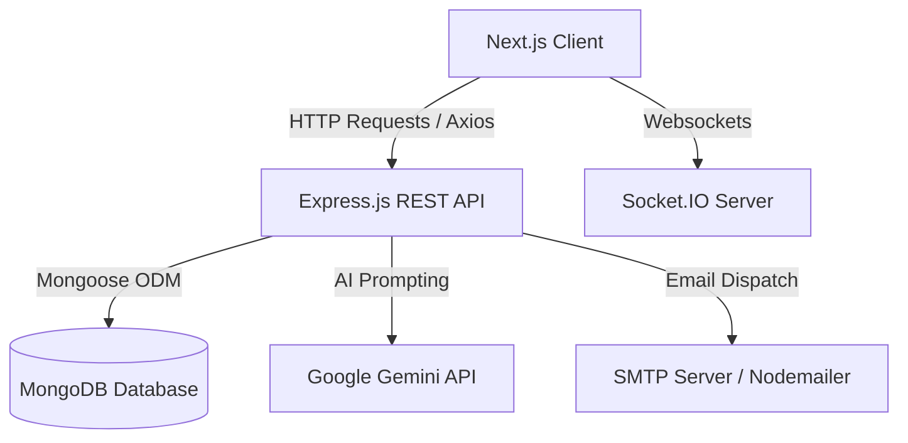

# System Design Document

This document provides a comprehensive overview of the system architecture, design decisions, database models, real-time message sync, and notification dispatch mechanisms implemented in the Rent & Flatmate Finder platform.

---

## 1. Architectural Overview

The application utilizes a decoupled client-server architecture consisting of a Next.js frontend application and an Express.js backend API, connected to a MongoDB database.



### Key Design Decisions:
* **Separation of Concerns**: The REST backend operates completely statelessly. User state and authorization are stored in client-side storage (`localStorage`) using JSON Web Tokens (JWT) signed by the backend.
* **Componentized Clients**: Frontend pages leverage React Query (`@tanstack/react-query`) to cache, validate, and synchronize server state cleanly, ensuring immediate UI feedback and avoiding redundant API queries.
* **Role-Based Authorization**: A unified middleware architecture intercepts requests, verifying permissions for `tenant`, `owner`, and `admin` roles, preventing cross-tenant data leaks.

---

## 2. Database Design & Integrity

The application utilizes MongoDB due to its document-oriented model, which aligns perfectly with listing profiles and chat histories. Data relationships and constraints are enforced using Mongoose schemas.

```text
  +-------------+                 +----------------+
  |    User     | <-------------> | TenantProfile  |
  +-------------+                 +----------------+
      ^     ^
      |     |
      v     v
  +-------------+                 +----------------+
  |   Listing   | <-------------> | Compatibility  |
  +-------------+                 +----------------+
      ^     ^
      |     |
      v     v
  +-------------+                 +----------------+
  |  Interest   | <-------------> |    Message     |
  +-------------+                 +----------------+
```

### Models & Constraints:
1. **User**: Stores authentication details. The `role` enum restricts users to `tenant`, `owner`, or `admin`.
2. **TenantProfile**: Stores searching preferences (budget boundaries, preferred location, amenities). It maintains a `unique` 1:1 relation with the `User` schema.
3. **Listing**: Handles room details (rent, location, status, roomType, genderPreference). Set default status to `"Available"`.
4. **Compatibility**: Stores calculations for compatibility. It maintains a **composite index** on `{ tenant: 1, listing: 1 }` with a `unique: true` constraint, preventing duplicate calculations.
5. **Interest**: Records matching requests. Enforces a composite unique index on `{ tenant: 1, listing: 1 }` to prevent duplicate applications.
6. **Message**: Log records for the chat system, storing `sender`, `recipient`, and `content`. It indices records by `createdAt` to support chronological sorting.

### Cascade Deletion Strategy:
To maintain database integrity, deleting a user (via the Admin panel) triggers a cascade:
* Deleting a `tenant` user removes their `TenantProfile`, all sent `Interest` applications, and computed `Compatibility` records.
* Deleting an `owner` user query-resolves their listings, deletes all `Interest` applications and `Compatibility` documents linked to those listings, and then deletes the listings.

---

## 3. AI Compatibility Matchmaker Design

The core value proposition of the app is calculating the roommate/room compatibility score.

### Gemini API Integration:
When a tenant requests compatibility details for a listing:
1. The backend fetches the `TenantProfile` and the target `Listing`.
2. It sends a structured prompt containing location, budget, room type, and amenities details to the **Google Gemini API (`gemini-1.5-flash`)**.
3. The prompt explicitly instructs Gemini to return **only** a valid JSON block:
   ```json
   {
     "score": 85,
     "explanation": "Summarized reason for matching details."
   }
   ```
4. The system configures the model using `responseMimeType: "application/json"` to ensure JSON compliance, parses the response, and saves it in the `Compatibility` collection.

### Robust Local Fallback (Rule-Based):
If the Gemini API key is missing or calls fail, the backend triggers a robust rule-based calculation:
* **Location Match (Max 30 pts)**: Scans for substring containment (e.g., "Queens" matching "Queens Village" or "Queens Blvd").
* **Budget Match (Max 35 pts)**: Full points if rent falls inside the budget. Cheaper rent receives partial points (30). Rent exceeding the max budget is penalized dynamically based on the percentage over budget.
* **Room Type Match (Max 20 pts)**: Exact match gets 20 points, mismatch gets 5 points.
* **Amenities Match (Max 15 pts)**: Calculates the ratio of matching amenities to requested amenities, scaling the remaining 15 points.

This fallback ensures 100% platform availability and instant performance while mimicking the scoring patterns of the AI model.

---

## 4. Real-Time Messaging Architecture

Rather than polling REST endpoints, communication between tenants and owners is managed via WebSockets using **Socket.IO**.

### Namespace Room Routing:
To restrict communication to relevant parties, room namespaces are generated using the unique composite:
```text
Room Name = [ListingId]_[TenantId]
```
This isolates discussions. Even if a tenant is communicating with the same owner about two different listings, the chat history remains distinct.

### Lifecycle of a Message:
1. **Join Room**: When loading the chat window, the client emits `join_room` with `listingId` and `tenantId`. The server socket joins the channel.
2. **Send Message**: The sender client emits `send_message` with message content, sender, recipient, listing, and tenant IDs.
3. **Persist & Broadcast**: The socket server saves the message to MongoDB and immediately emits `receive_message` **only** to the room namespace, guaranteeing delivery to online clients without affecting other rooms.

---

## 5. Automated Notification Dispatch Flow

Notifications are crucial to closing interest loops.

```text
[Tenant Expresses Interest]
            │
            ▼
[Fetch or Calculate Compatibility]
            │
     Is Score > 80?
     ├── Yes ──> [Trigger Nodemailer High Compatibility Alert Email to Owner]
     └── No  ──> [Skip Email, Save Request]

─────────────────────────────────────────────────────────────────────────────

[Owner Accepts or Rejects Request]
            │
            ▼
[Trigger Nodemailer Status Update Email to Tenant]
```

### Asynchronous Design & Simulated Fallback:
Emails are dispatched asynchronously during controller execution to avoid blocking REST response loops. 
To ensure local developer environments remain completely operational, the email dispatch module features a **console simulation fallback**:
* If `EMAIL_USER` and `EMAIL_PASS` are set in `.env`, the service initializes a Nodemailer transport (e.g., Gmail or Ethereal SMTP) and sends a HTML-formatted email.
* If credentials are empty, it prints the simulated email headers and content block to the backend console logs. This facilitates debugging without external dependencies.
